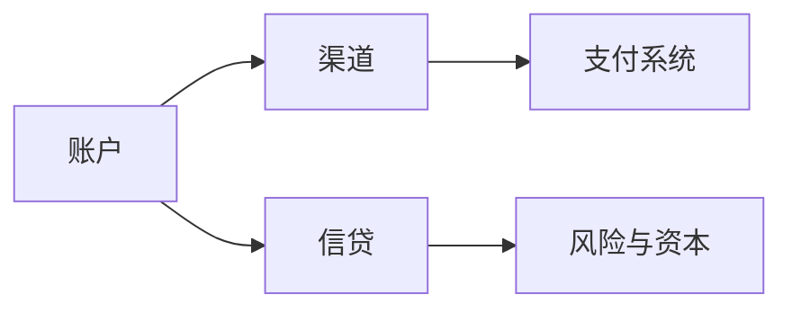

## 银行业

银行业对应商业银行的资产负债与中间业务。收入来自利差、手续费。对公支付的授权矩阵属于银行渠道，跨机构的清算与结算属于[支付清算与金融监管](../infrastructure-regulation/index.md)中的支付系统。

-   [零售银行](retail-banking.md)：个人账户、卡片与渠道
-   [对公与交易银行](corporate-banking.md)：现金管理、贸易与财资
-   [信贷与风控](credit-and-risk.md)：准入、定价、贷后与模型风险

跨行清算、银联网联与对账见[支付与清算](../infrastructure-regulation/payments-and-clearing.md)。

## 相关阅读

-   [金融](../index.md)
-   [商业银行](../../../business/01-finance/11-commercial-banks.md)
