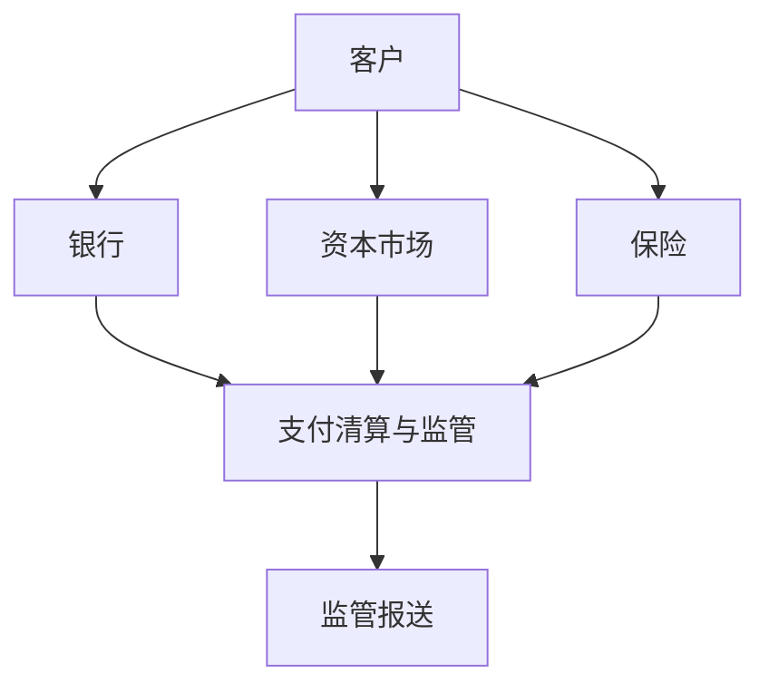

## 金融

货币、利率、报表和估值的课堂底座在 [商业与财会](../../business/index.md)。本行业落到持牌机构如何展业：银行、证券基金、保险，以及跨机构的支付清算、征信和反洗钱义务。

划分依据是中国的分业经营、分业监管：银行业、证券业、保险业分开持牌。支付系统、中央证券存管、清算结算等由央行口径列入金融市场基础设施。征信业与反洗钱是央行的法定职责，与基础设施一并写入支付清算与金融监管。

-   [银行业](banking/index.md)：零售、对公、信贷与风控
-   [资本市场](capital-markets/index.md)：经纪财富、投行、资管、交易与市场结构
-   [保险业](insurance/index.md)：人身险、财产险、再保险与精算
-   [支付清算与金融监管](infrastructure-regulation/index.md)：支付清算、征信、反洗钱、监管科技

金融 AI 落在预审、抽取、监测、质检。开户、放款、承保、报备的法定责任仍在持牌机构。

## 产品约束

验收看不良率、欺诈损失、理赔周期、报送一次通过率。模型要能解释到字段和规则；被问「为什么拒贷」时，要拿得出当时的特征、阈值和人工覆盖记录。

## 相关阅读

-   [商业与财会](../../business/index.md)
-   [商业银行经营与管理](../../business/06-commercial-banking/index.md)
-   [前沿金融实务专题](../../business/19-frontier-finance-practice/index.md)
