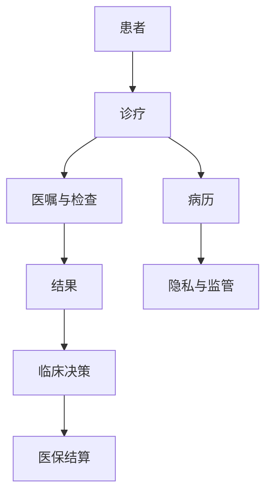

## 医疗健康

医疗产品的错误半径是健康损害。诊断、处方和手术决策的责任在执业医师和医疗机构。

划分依据是卫生健康、药品监管与医疗保障的职能分工：医疗服务（临床），药品与医疗器械（药监），医院运行、医疗保障与公共卫生（卫生事业），卫生信息标准与药械注册路径（信息与监管）。

-   [临床医学](clinical/index.md)：诊疗路径、影像、检验与病理
-   [药学与医疗器械](pharma-device/index.md)：药物研发、器械与数字疗法
-   [卫生事业管理](operations/index.md)：医院信息化、医保支付、公共卫生
-   [卫生信息与监管](data-compliance/index.md)：互操作、药械注册与质量体系

## 产品约束

上线路径经常是医疗器械注册或科研用途。评测按病种、设备、人群分层，并保留医师覆盖。宣传用语受广告和器械法规约束。

## 相关阅读

-   [AI 安全](../../ai/ai-safety.md)
-   [评估与评测](../../ai/evaluation.md)
-   [寿险与健康险](../finance/insurance/life-and-health.md)
