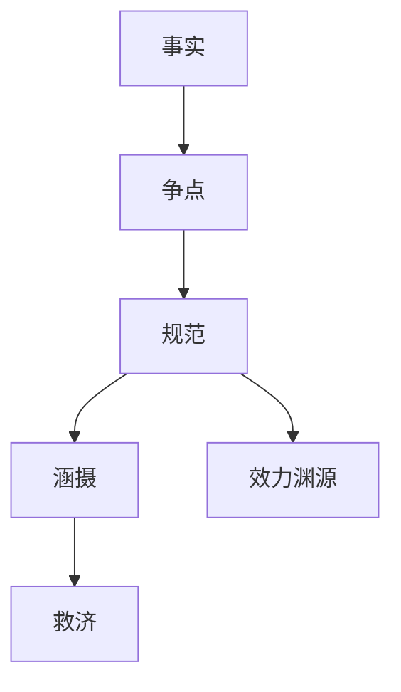

## 法律

法律处理有层级的规范、有时效的文本和有责任人的结论。引用错误的后果是错误法律意见。

划分依据是法学结构：先按部门法确定调整对象、效力和救济程序，再进入法律职业活动。法律科技提供检索、审查和证据工具。本栏目部门法先写宪法与行政法、民商法、刑法、国际法；经济法、社会法、环境资源法的产品问题写入法律实务。

-   [部门法](legal-system/index.md)：宪法与行政法、民商法、刑法、国际法
-   [法律实务](practice/index.md)：合同尽调、诉讼仲裁、知识产权、劳动合规
-   [法律科技](legaltech/index.md)：检索、合同审查、电子取证、智慧司法

模型可以辅助检索和起草。法律结论由律师、法官或适格主体做出。

## 产品约束

验收看引用能否落到权威文本、是否标明失效与修订、是否区分检索结果与法律意见。

## 相关阅读

-   [知识库问答](../../practice/kb-qa.md)
-   [提示词安全](../../ai/prompt-security.md)
